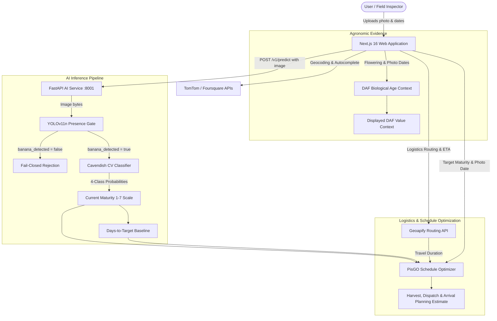

# PisGO 🍌

**AI-Powered Harvest and Arrival Maturity Planning for Smart Banana Distribution**

[](https://pisgo.my.id)
[](https://github.com/Vluuuu/pisgo/releases/tag/aic-preliminary-models-v1)
[](#)

PisGO is an intelligent decision-support platform designed to help Cavendish banana growers and distribution networks plan harvest and dispatch timing based on a desired maturity level at destination. By combining computer vision presence gating, visual ripeness classification, contextual biological-age tracking, and route-aware transit modeling, PisGO delivers projected harvest-to-arrival schedule recommendations.

---

## What is PisGO?

PisGO transforms subjective, disconnected banana harvesting decisions into a data-driven planning workflow. Rather than guessing harvest timing or ignoring transit ripening, users provide a bunch photo, flowering date, target maturity, and route parameters. PisGO inspects the photo, estimates visual ripeness, tracks biological age progress, and calculates transit duration to deliver an actionable harvest, shipping, and arrival planning estimate.

---

## ✨ MVP Features

* **YOLO Banana Bunch Presence Gate**: Frozen YOLOv11n object detector verifies bunch presence before running maturity inference.
* **4-Class Visual Maturity Classifier**: Computer Vision model classifies ripeness (`unripe`, `half_ripe`, `ripe`, `overripe`) and maps probabilities onto the 1–7 operational scale.
* **DAF Biological-Age Context**: Calculates Days After Flowering (DAF) as contextual agronomic evidence alongside visual inspection.
* **Multi-Modal Route & ETA Calculation**: Computes real-world road transit distances and vehicle-specific durations (e.g., light truck) via geocoding and routing APIs.
* **Harvest & Shipping Schedule Optimizer**: Generates recommended harvest, shipping, and arrival dates alongside projected arrival maturity.
* **Native Field Inspection Camera**: Browser-native camera capture with live preview, retake options, and gallery upload support.

---

## 🔄 How It Works



> **Scientific Transparency Note on DAF**: The current MVP calculates DAF as biological-age context/evidence. It is not yet fused directly into the scheduling heuristic; longitudinal calibration is required before using DAF as a quantitative maturity-rate modifier. Separately, the schedule optimizer computes delivery timing using current visual maturity, days-to-target, target maturity, travel duration, and photo date.

---

## 🚀 Setup Guide — Docker Compose

### Prerequisites
* [Git](https://git-scm.com/)
* [Docker Desktop](https://www.docker.com/products/docker-desktop/) (with Docker Compose)
* [GitHub CLI (`gh`)](https://cli.github.com/) *(optional, for one-command model download)*

### 1. Clone Repository
```bash
git clone https://github.com/Vluuuu/pisgo.git
cd pisgo
```

### 2. Download Model Artifacts
Download the required model artifacts into `ml/models/`:

```bash
# Using GitHub CLI
gh release download aic-preliminary-models-v1 --dir ml/models

# Or download manually from:
# https://github.com/Vluuuu/pisgo/releases/tag/aic-preliminary-models-v1
```

### 3. Environment Setup
```bash
# Linux / macOS
cp .env.example .env

# Windows PowerShell
Copy-Item .env.example .env
```

Configure API keys in `.env` (Docker Compose automatically wires internal `AI_API_BASE_URL=http://ai-api:8001`):
* **`GEOAPIFY_API_KEY`**: Required for logistics routing, distance, and duration/ETA.
* **`TOMTOM_API_KEY`**: Required for location autocomplete search and geocoding.
* **`FOURSQUARE_API_KEY`**: Optional fallback for categorized POI search.

### 4. Build & Run
```bash
docker compose up --build -d
```

### 5. Verify & Access
* **Web Application**: [http://localhost:3000](http://localhost:3000)
* **AI Service Health**: [http://localhost:8001/health](http://localhost:8001/health) (Expected: `{"status":"ok","model_loaded":true}`)

### 6. Stop Containers
```bash
docker compose down
```

---

## 🔬 AI / ML Pipeline

* **YOLOv11n Presence Detector**: Fine-tuned class-0 (`banana_bunch`) detector acting as a strict presence gate ($\ge 0.25$ threshold). It does not classify maturity.
* **Cavendish Maturity Classifier**: Feature extractor (RGB/HSV, spatial grid, edge/texture) + `StandardScaler` + Multinomial Logistic Regression classifying 4 maturity stages, mapped to the 1–7 scale via probability-weighted blending.

Detailed ML architecture and training pipelines are documented in [`ml/README.md`](ml/README.md) and [`services/ai-api/README.md`](services/ai-api/README.md).

---

## 📊 Model Evaluation Transparency

| Metric | YOLOv11n Presence Gate |
|---|---:|
| **Curated Detector Dataset** | 322 images (241 positive, 81 hard-negative) |
| **Held-out Test Partition** | 48 images (36 positive, 12 negative) |
| **Precision** | 75.61% |
| **Recall** | 72.22% |
| **mAP@50** | 71.55% |
| **mAP@50–95** | 35.27% |

*The 48-image held-out set is the dedicated ~15% test partition evaluated separately from training data. These metrics represent an MVP detector benchmark under controlled splits, not an operational field agronomic claim. See [`ml/README.md`](ml/README.md) for full details.*

---

## 📦 Required Model Artifacts

Artifacts are hosted on GitHub Releases: [`aic-preliminary-models-v1`](https://github.com/Vluuuu/pisgo/releases/tag/aic-preliminary-models-v1).

| Artifact File | Size | SHA-256 Checksum |
|---|---|---|
| `banana_bunch_yolo11n_emergency_v1.pt` | 21,234,723 B | `d8e3ca2b0305a0755cae707f2969486674d98761d14b2c79a02a43ba7f5ce26e` |
| `cavendish_maturity_classifier.joblib` | 15,409 B | `117c1f134670ac9b3ebc1b9d3f8a1d81549ec3fbd23f159b741238325f187c9e` |

For manual placement and integrity verification commands, see [`ml/models/README.md`](ml/models/README.md).

---

## 📂 Repository Structure

```text
pisgo/
├── apps/web                 # Next.js 16 frontend application & API routes
├── services/ai-api          # FastAPI model inference adapter microservice
├── ml                       # Machine learning package, configs, and training pipelines
├── docs                     # Technical specifications & architecture diagrams
├── shared/schemas           # JSON Schema prediction contract definitions
├── docker-compose.yml       # Local multi-container Docker orchestration
└── README.md
```

---

## ⚠️ Limitations & Disclaimers

* **Uncalibrated Model Confidence**: Prediction confidence reflects raw classifier softmax scores, not calibrated field certainty probabilities.
* **Heuristic Ripening Rate**: Ripening rate is currently a temporary linear MVP planning heuristic ($0.15$ scale units/day) pending longitudinal field calibration.
* **Independent DAF Evidence**: DAF biological age is calculated as contextual evidence and is not yet directly fused into the scheduling heuristic.
* **Controlled Training Baseline**: Visual classification baseline was trained on studio-controlled imagery and requires broader on-field dataset expansion for commercial deployment.

---

## 📚 Documentation

* **[Architecture Specification](docs/architecture.md)** — High-level components and service boundaries.
* **[AI Prediction Contract](docs/api-contract.md)** — Request/response JSON Schema definitions.
* **[Machine Learning Package](ml/README.md)** — Feature extraction, training, and evaluation workflows.
* **[Model Artifacts Guide](ml/models/README.md)** — Download links, checksums, and artifact management.
* **[FastAPI AI Service](services/ai-api/README.md)** — Endpoint schemas, presence gating, and adapter logic.
* **[Web Application](apps/web/README.md)** — Next.js routing, geocoding fallback, and frontend setup.

---

## 📄 License & Attribution

* Built for **COMPFEST 18 AI Innovation Challenge**.
* Computer Vision YOLO detector utilizes Ultralytics YOLOv11 (AGPL-3.0).
* Maps & Tiles courtesy of Geoapify, OpenStreetMap, TomTom, and Foursquare.
