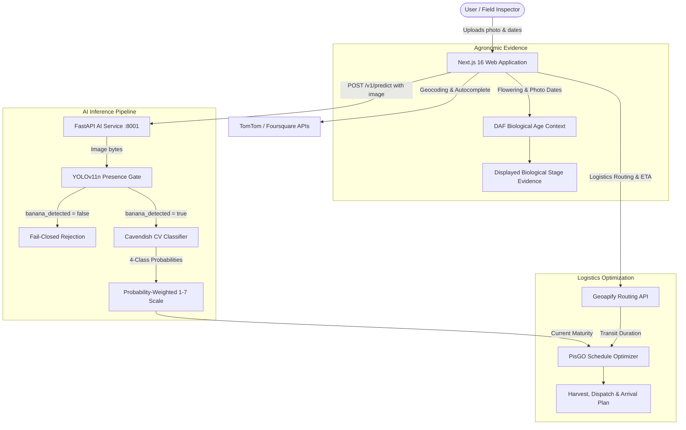

# PisGO 🍌

**AI-Powered Harvest and Arrival Maturity Planning for Smart Banana Distribution**

[](https://pisgo.my.id)
[](https://github.com/Vluuuu/pisgo/releases/tag/aic-preliminary-models-v1)
[](#)

PisGO is a decision-support platform designed to help Cavendish banana growers, packhouses, and distribution networks determine optimal harvest and shipping dates so bananas arrive at target markets at the desired maturity level (scale 1–7).

---

## 📌 Overview & Problem

Cavendish banana logistics face high post-harvest losses and quality mismatches due to:
1. **Subjective maturity assessment**: visual maturity estimation in the field is prone to human error.
2. **Transit ripening misalignment**: bananas continue ripening during road transit, causing premature over-ripening or deliveries that are too green for immediate retail.
3. **Disconnected planning**: field biological age (Days After Flowering / DAF), visual ripeness, and logistical travel durations are rarely optimized together in a single decision pipeline.

PisGO bridges this gap by combining computer vision presence detection, visual maturity classification, biological-age heuristics, and route-aware transit modeling into an actionable harvest-to-arrival schedule.

---

## ✨ What PisGO Does (MVP Features)

* **Banana Bunch Presence Gate**: YOLOv11n object detector verifies the presence of banana bunches before running downstream classification.
* **4-Class Visual Maturity Estimation**: Computer Vision classifier assesses bunch ripeness (`unripe`, `half_ripe`, `ripe`, `overripe`) and maps class probabilities onto the PisGo 1–7 operational scale.
* **DAF Biological-Age Baseline**: Calculates Days After Flowering (DAF) from flowering and observation dates, categorizing biological progress into deterministic developmental stages as contextual agronomic evidence.
* **Multi-Modal Logistics Routing**: Calculates real-world route distances, road transit durations, and travel geometry using geocoding and vehicle-specific routing APIs (e.g., light trucks).
* **Harvest & Shipping Schedule Optimizer**: Computes recommended harvest date, recommended dispatch date, expected arrival date, and projected maturity upon arrival.
* **Native Field Inspection Camera**: Browser-native camera capture with real-time preview, retake, and local image upload support.

---

## 🏗️ System Architecture



> **Scientific Transparency Note on DAF**: The current MVP calculates DAF as biological-age context/evidence. It is not yet fused into the scheduling heuristic; longitudinal calibration is required before using DAF as a quantitative maturity-rate modifier. Separately, the schedule optimizer computes delivery timing using current visual maturity, target maturity, travel duration, and photo date.

---

## 🔬 AI / ML Pipeline

### 1. Banana Bunch Presence Gate (YOLOv11n)
* **Architecture**: Ultralytics YOLOv11n fine-tuned on banana bunch datasets.
* **Role**: Class-0 detector gating inference. If no banana bunch is detected above threshold ($\ge 0.25$), maturity inference is bypassed and null-safe outputs are returned.
* **Artifact**: `ml/models/banana_bunch_yolo11n_emergency_v1.pt` (SHA-256: `d8e3ca2b0305a0755cae707f2969486674d98761d14b2c79a02a43ba7f5ce26e`).

### 2. Visual Maturity Classifier (Cavendish 4-Class)
* **Architecture**: Color/texture feature extractor (RGB/HSV histograms, spatial grid statistics, edge/saturation ratios) + `StandardScaler` + Multinomial Logistic Regression.
* **Classes**: `unripe`, `half_ripe`, `ripe`, `overripe`.
* **Mapping to UI Scale (1–7)**:
  $$\text{Current Maturity} = \sum_{c \in \text{classes}} P(c) \times \text{Anchor}(c)$$
  Anchors: `unripe: 2.0`, `half_ripe: 3.5`, `ripe: 5.5`, `overripe: 6.5`.
* **Artifact**: `ml/models/cavendish_maturity_classifier.joblib` (SHA-256: `117c1f134670ac9b3ebc1b9d3f8a1d81549ec3fbd23f159b741238325f187c9e`).

### 3. DAF Biological-Age Baseline
* **Formula**: $\text{DAF} = \text{photo\_date} - \text{flowering\_date}$ (whole calendar days, clamped $\ge 0$).
* **Progress**: $\text{Age Progress} = \min(\max(\text{DAF} / 120, 0.0), 1.0)$.
* **Developmental Stages**:
  * $0\% - 25\%$: `early_development`
  * $25\% - 50\%$: `developing`
  * $50\% - 75\%$: `late_development`
  * $75\% - 100\%$: `approaching_harvest`
  * $\ge 100\%$: `harvest_window_or_later`

---

## 📊 Model Evaluation Transparency

### YOLOv11n Held-Out Evaluation
Evaluated on a held-out test split of 48 images (36 positive banana bunch images, 12 verified negative background/non-banana images) at IoU 0.50 threshold:
* **Precision**: ~75.61%
* **Recall**: ~72.22%
* **mAP@50**: ~71.55%
* **mAP@50-95**: ~35.27%
* **Negative Image False Positives**: 4 detections across 3/12 negative images.
* **Positive Image False Negatives**: 9 missed annotations across positive images.

### Maturity Classifier Evaluation
The CV baseline achieved high classification accuracy on controlled dataset splits. However, this is treated strictly as an MVP development baseline and not a universal agronomic field validation claim.

---

## 📂 Repository Structure

```text
pisgo/
├── apps/
│   └── web/                 # Next.js 16 frontend & API routes
│       ├── app/             # Next.js App Router (pages, layout, styles)
│       ├── components/      # UI components (prediction, map, camera)
│       ├── lib/             # API clients, optimizer, date & format utils
│       ├── types/           # TypeScript definitions
│       └── Dockerfile       # Web container definition
├── ml/                      # Machine Learning package
│   ├── configs/             # YAML configurations for training/evaluation
│   ├── data/sample/         # Synthetic sample CSVs for testing
│   ├── models/              # Local model weights directory (pt, joblib)
│   ├── src/pisgo_ml/        # Core ML source code
│   └── tests/               # Pytest unit tests for ML pipeline
├── services/
│   └── ai-api/              # FastAPI model inference adapter service
│       ├── app/             # API routes, schemas, detector & adapter logic
│       ├── tests/           # Pytest suite for FastAPI endpoints
│       └── Dockerfile       # AI service container definition
├── shared/
│   └── schemas/             # JSON schemas defining API prediction contracts
├── docker-compose.yml       # Local multi-service orchestration
├── .env.example             # Environment variable template
└── README.md
```

---

## 🛠️ Tech Stack

* **Frontend**: Next.js 16 (React 19, TypeScript), Tailwind CSS, Leaflet, Phosphor Icons.
* **Backend / AI Service**: FastAPI, Uvicorn, Pydantic v2.
* **Machine Learning**: Ultralytics YOLOv11, Scikit-learn, NumPy, Pillow, Joblib.
* **Geospatial & Logistics**: Geoapify Routing & Autocomplete APIs, TomTom Search API, Foursquare Places API.
* **Containerization & Deployment**: Docker & Docker Compose, Cloudflare Workers / OpenNext.

---

## 🔑 Environment Variables

Copy `.env.example` to `.env` (or `apps/web/.env.local` for local Next.js development):

| Variable | Scope | Required | Example Placeholder | Purpose |
|---|---|:---:|---|---|
| `GEOAPIFY_API_KEY` | Server (Web) | Yes | `your_geoapify_api_key_here` | Logistics routing and map tile fetching |
| `TOMTOM_API_KEY` | Server (Web) | Optional | `your_tomtom_api_key_here` | Address search & location autocomplete fallback |
| `FOURSQUARE_API_KEY` | Server (Web) | Optional | `your_foursquare_api_key_here` | POI search fallback |
| `AI_API_BASE_URL` | Server (Web) | Yes | `http://localhost:8001` (Docker: `http://ai-api:8001`) | Target URL for FastAPI inference service |
| `CV_MODEL_PATH` | Server (AI) | Optional | `ml/models/cavendish_maturity_classifier.joblib` | Path to visual classifier Joblib artifact |
| `DETECTOR_MODEL_PATH` | Server (AI) | Optional | `ml/models/banana_bunch_yolo11n_emergency_v1.pt` | Path to YOLO detector checkpoint |
| `NEXT_PUBLIC_APP_NAME` | Client (Web) | No | `PisGo` | Application brand name display |

*Note: In Docker Compose, `AI_API_BASE_URL` is automatically configured to `http://ai-api:8001`.*

---

## 📦 Required Local Model Artifacts

To run AI inference locally or in Docker, the following model weights must be placed under `ml/models/`:

1. **`banana_bunch_yolo11n_emergency_v1.pt`**
   * Purpose: Frozen YOLOv11n banana bunch presence detector.
   * File Size: `21,234,723 bytes`
   * SHA-256: `d8e3ca2b0305a0755cae707f2969486674d98761d14b2c79a02a43ba7f5ce26e`
   * Download: [GitHub Release Asset](https://github.com/Vluuuu/pisgo/releases/download/aic-preliminary-models-v1/banana_bunch_yolo11n_emergency_v1.pt)
2. **`cavendish_maturity_classifier.joblib`**
   * Purpose: 4-class Cavendish visual maturity classifier.
   * File Size: `15,409 bytes`
   * SHA-256: `117c1f134670ac9b3ebc1b9d3f8a1d81549ec3fbd23f159b741238325f187c9e`
   * Download: [GitHub Release Asset](https://github.com/Vluuuu/pisgo/releases/download/aic-preliminary-models-v1/cavendish_maturity_classifier.joblib)

### Quick Artifact Download Command

```bash
# Using GitHub CLI (recommended)
gh release download aic-preliminary-models-v1 --dir ml/models

# Or using curl / wget
curl -L -o ml/models/banana_bunch_yolo11n_emergency_v1.pt \
  https://github.com/Vluuuu/pisgo/releases/download/aic-preliminary-models-v1/banana_bunch_yolo11n_emergency_v1.pt

curl -L -o ml/models/cavendish_maturity_classifier.joblib \
  https://github.com/Vluuuu/pisgo/releases/download/aic-preliminary-models-v1/cavendish_maturity_classifier.joblib
```

### Verification Command (PowerShell / Bash)
```bash
# PowerShell
Get-FileHash ml/models/banana_bunch_yolo11n_emergency_v1.pt -Algorithm SHA256
Get-FileHash ml/models/cavendish_maturity_classifier.joblib -Algorithm SHA256

# Linux / macOS
sha256sum ml/models/banana_bunch_yolo11n_emergency_v1.pt ml/models/cavendish_maturity_classifier.joblib
```

*If artifacts are missing at startup, the AI API service will fail-closed and return `503 Service Unavailable` with `"model_loaded": false` on `/health`.*

---

## 🚀 Quick Start with Docker Compose (Recommended)

Ensure Docker Desktop is running, then execute:

```bash
# 1. Clone repository
git clone https://github.com/Vluuuu/pisgo.git
cd pisgo

# 2. Download model artifacts into ml/models/
gh release download aic-preliminary-models-v1 --dir ml/models

# 3. Set up environment variables
cp .env.example .env
# (Optional) Add your GEOAPIFY_API_KEY to .env for live routing

# 4. Build & start containers
docker compose build
docker compose up -d

# 5. Verify running containers
docker compose ps
```

* **Web Application**: Open [http://localhost:3000](http://localhost:3000)
* **AI Service Health**: Open [http://localhost:8001/health](http://localhost:8001/health)

To stop the containers:
```bash
docker compose down
```

---

## 💻 Manual Local Development (Non-Docker)

### 1. AI Inference Service
```bash
# From repository root
python -m venv .venv

# Activate venv (Windows)
.\.venv\Scripts\Activate.ps1
# Activate venv (Linux/macOS)
source .venv/bin/activate

# Install dependencies
pip install -e ./ml
pip install -r ./services/ai-api/requirements.txt

# Run FastAPI service
uvicorn app.main:app --app-dir ./services/ai-api --host 127.0.0.1 --port 8001
```

### 2. Web Application
```bash
# From repository root
cd apps/web
npm ci

# Configure environment
cp ../../.env.example .env.local

# Run Next.js development server
npm run dev
```

---

## 🧪 Testing & Verification

All test suites can be executed with existing commands:

```bash
# Web unit tests (53 tests)
cd apps/web && npm test

# Web TypeScript typecheck
cd apps/web && npm run typecheck

# Web ESLint
cd apps/web && npm run lint

# Web production build
cd apps/web && npm run build

# ML unit tests (68 tests)
pytest ml/tests

# FastAPI service tests (37 tests)
pytest services/ai-api/tests
```

---

## 🌐 Production Deployment

* **Live Demo**: [https://pisgo.my.id](https://pisgo.my.id)
* **Production Web Hosting**: Next.js deployed on Cloudflare Workers edge runtime via OpenNext.
* **AI Service**: FastAPI model inference service providing prediction endpoints.

---

## ⚠️ MVP Limitations & Disclaimers

1. **Uncalibrated Confidence**: Prediction confidence reflects raw classifier softmax outputs, not calibrated field certainty.
2. **Transit Ripening Model**: Ripening rate is currently a temporary MVP planning heuristic ($0.15$ scale units/day) pending longitudinal field calibration rather than a dynamic thermodynamic chamber simulation.
3. **Controlled CV Baseline**: The visual classifier was trained on studio-controlled specimen imagery and should be calibrated with real field photography for operational deployment.
4. **Agronomic Variables**: Microclimate (temperature, ethylene exposure, RH) during transit is assumed constant in the baseline optimizer.

---

## 🗺️ Future Roadmap

* [ ] Fine-grained multi-bunch detection and segmentation across varying canopy densities.
* [ ] IoT real-time temperature & ethylene sensor telemetry integration for dynamic transit rerouting.
* [ ] Multi-cultivar expansion beyond Cavendish (e.g., Kepok, Raja, Mas).
* [ ] Multi-depot Vehicle Routing Problem with Time Windows (VRPTW) dispatch optimization.

---

## 📄 License & Attribution

* Built for **COMPFEST 18 AI Innovation Challenge**.
* Computer Vision YOLO detector utilizes Ultralytics YOLOv11 (AGPL-3.0).
* Maps & Tiles courtesy of Geoapify, OpenStreetMap, TomTom, and Foursquare.
